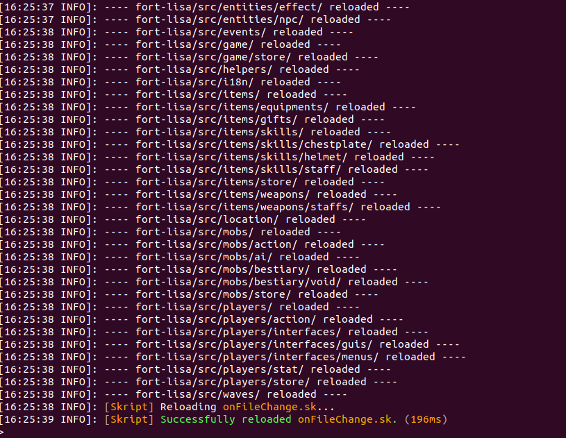

# Server install

Download Paper here: https://papermc.io/downloads. Choose the last build of **1.19.3** version.
Create a file named `start.bat` on Windows, or `start.sh` on Linux.

**start.bat**
```
@echo off

java -Xms2G -Xmx2G -jar paper-251.jar
pause
```
**start.sh**
```
java -Xmx1024M -Xms512M -jar paper-1.19.3-431.jar
```

⚠️ Do not forget to replace paper-251.jar by the version you have downloaded.

Execute the starter script.  
Once server finished its initialization, stop it.

# Launch Fort-Lisa
- Go to plugins/Skript/scripts
- Clone the repo here
- Go to plugins/Skript/scripts/fort-lisa/dependencies
- Copy all jar into plugins/
- Create a .env file and copy the content of .env.example inside.
- Set `ENABLE_HOT_RELOAD` to `TRUE`
- Restart the server

# Install the map
- On your local server, delete the folder world/
- We can find zip files into maps/ folder of the repo
- Extract one of the archive in the root of your local server.
- Rename the extraction to world/
- Restart the server 

# HMR
- If serveur start is healthy, you should see following messages:

It means HMR is enabled and running on all the following folders.
- HMR is only enabled for src/ folder
- In game, you can type `/admin hmr reset` to restart the HMR. It can be usefull if you have added some folders and don't want to restart the server.

# Admin commands
You can find admin commands by running `/admin `. An autocompletion will help you.  
All commands ar ebeing declared under `core/commands/cli.sk`