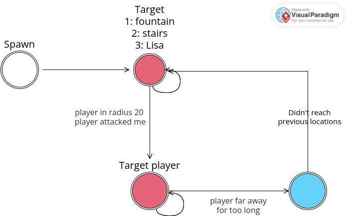

# AI patterns

Here is a description of implemented patterns:

## Pattern "A"

Right after spawning, The mob go to the fountain. While moving, it checks for players in a radius of 20 blocks. If a player is found, or if the mob has been attacked, it will go to him. While going, if the player is too far away, the mob will go to its original location target after a delay. When the mob has reached the fountain, it will then go to the stairs, and thereafter to Lisa.

<figure><figcaption></figcaption></figure>
