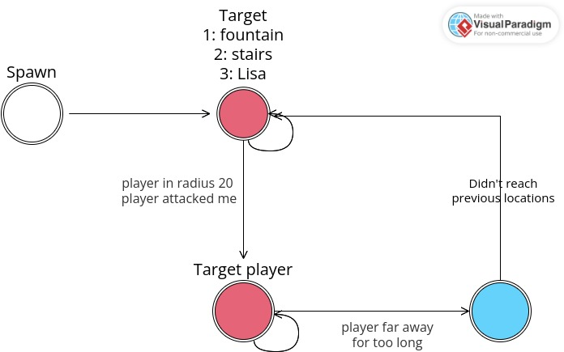

# GoToLisa\<n>

Higher is the **n** harder the mob tries to catch Lisa.

**0.** Right after spawning, The mob go to the fountain. While moving, it checks for players in a radius of 20 blocks. If a player is found, or if the mob has been attacked, it will go to him. While going, if the player is too far away, the mob will go to its original location target after a delay. When the mob has reached the fountain, it will then go to the stairs, and thereafter to Lisa.

<figure><figcaption></figcaption></figure>

1. Same idea, but radius is 5 blocs
2. Again, but radius is 0 block. Mob will attack player only if it has been touched by him
3. Mob just goes to Lisa
